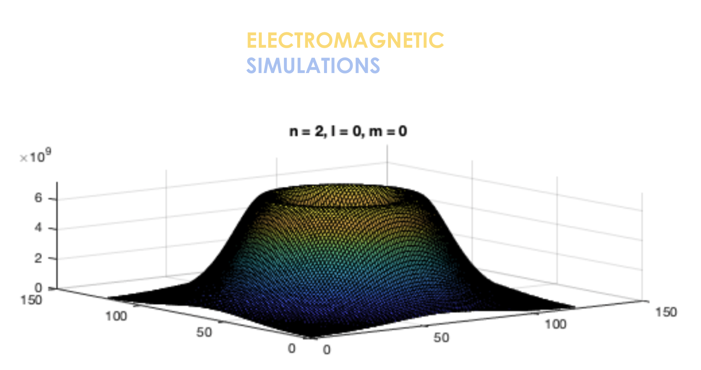

# Quantum-Models
Models of Quantum Phenomena and Solid State Devices

Models and 2D/3D simulations of Quantum phenomena including the Photoelectric Effect, Potential
Quantum Wells, Wave Functions and Probability Densities, PN Junctions, and MOSFETS
