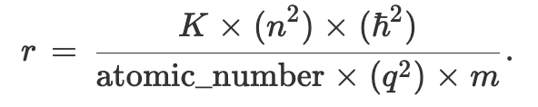
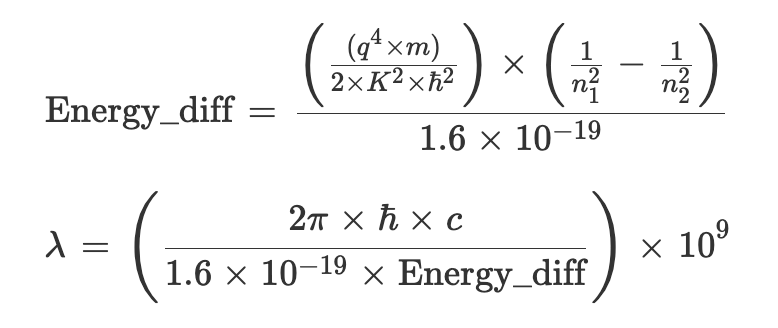
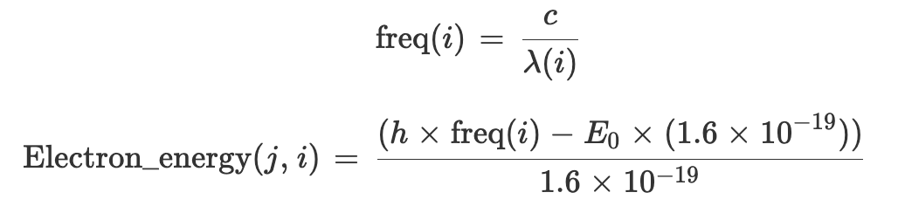
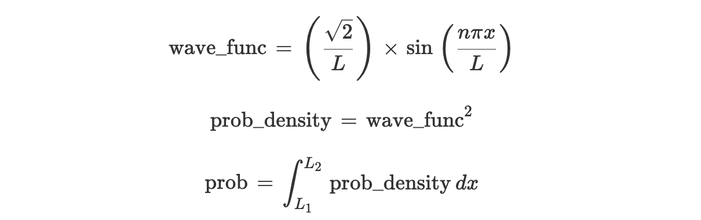
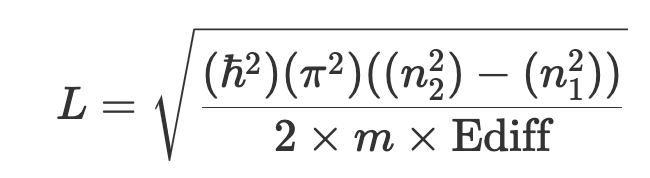

  <h1>⚛ Quantum-Models</h1>
  
Models of Quantum Phenomena and Solid State Devices

  

---

# 📖 Introduction
This is a project containing simulations models of Quantum Phenomena and Solid State Devices.

The models include 2D/3D simulations of Quantum phenomena including the Photoelectric Effect, Potential
Quantum Wells, Wave Functions and Probability Densities, PN Junctions, and MOSFETS.

# 👾 Simulations

Below are the different MATLAB simulation files included.
- **Atomic Radii**: Simulation of radii of atoms and ions when their electrons are at energy states 1-4. The folowing equations are used:

  

- **Ediff and wavelengths**: Simluation of the energy difference between energy/orbital levels in hydrogen, and the wavelength of the light emitted when an electron transitions from a higher energy level to a lower one. The folowing equations are used:

  

- **Photoelectric Effect**: Simulation of the energy of electrons that are emitted from metal surfaces that are hit by light ranging from 3000nm (IR) to 100nm (UVC). The folowing equations are used:

  

- **Infinite Quantum Well**: Simulation of the energy levels of an electron in an infinite potential energy well of length L that has infinitely high barriers. The folowing equations are used:

  

The probability density for electrons in the 1st to 4th energy states for a well of Length L=2nm. The folowing equations are used:

  

The probability of finding an electron between two points in the well L1 and L2, for an infinite well of length L. The folowing equations are used:

  

Simulation of a quantum well that can be used as the photon detector at the end of the fiber by calculating the length L of the quantum well. The folowing equations are used:

  

- **Probability Density and Wave Functions in 2D/3D**:
Simulations of the Probability density for hydrogen and helium of given energy values n. 2D and 3D plots for the first 4 hydrogen wavefunctions. Classic wavefunction equations for the different orbitals and values of n, m, and l were used in these simulations.

- **Finite Quantum Well**: A simulation using Newtons Method to find the kn value and the allowed energy values for a finite well of desired potential energy depth, length, and energy level. I found out if the energy level was even or odd, and using that used the appropriate equations for even and odd parity.

- **PN Junction**: Simulation of the different parts of a PN junction. Takes inputs of physical characteristics of the semiconductors and calculates the intrinsic carrier concentration for the material. Takes user inputs for Donor and Acceptor concentrations on the N and P side, and the material relativity, and calculates the built in potential, xn, xp, and the depletion region width. Graphs the internal electric field, electrostatic potential, and charge concentration against position. Repeats all the above calculations but by adding an applied forward bias. Calculation and and graph of the diode concentration and current based on the minority carrier concentrations on both the P and N sides, as well as the electron and hole current densities against position. Calculates and graphs the diode current vs voltage for a given range of applied potentials. Uses the method of numerical integration on the electric field ti determined the voltage drop across the depletion region.

- **MOSFET**: Simulation of a MOSFET threshold voltage and drain current using user inputs for the substrate doping, gate length, and gate width, as well as values for VD, VG, and VS. Asks for user inputs for VD, VG, and VS to put the MOSFET in saturation mode. Calculates the small signal values for gm, ro, Cgs, and Cdg.